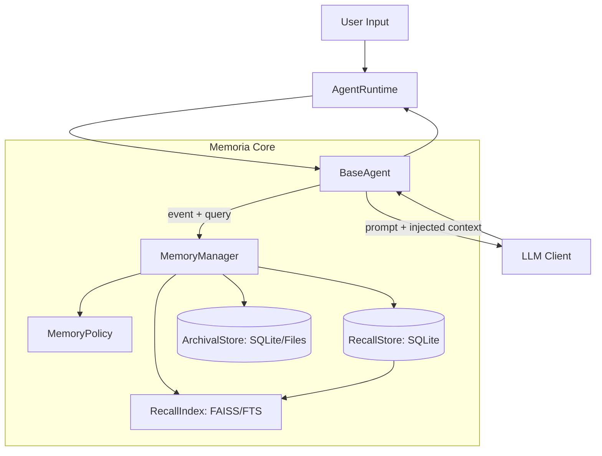

### Memoria：AI Partner Development Framework

## 1. 产品概述

### 1.1 背景与定位
**Memoria** 是一个轻量、隐私优先、异步原生的框架，用于构建具备**长期一致性**与**可控记忆**的 AI Partner（虚拟角色/NPC）。其核心差异点是围绕记忆分层建立端到端闭环：采集 → 过滤 → 存储 → 检索 → 注入上下文 → 演化（整合/遗忘）。

### 1.2 核心设计契约（你提出的设计）
- **Recall**：可用知识库（小而精），系统负责“正确使用、持续更新、必要时遗忘”。  
- **Archival**：档案库（大而全），系统负责“可追溯保存、按需查档”，默认不参与每轮对话。

> 直觉类比：Recall 像“常用笔记”，Archival 像“日志与档案室”。

### 1.3 目标用户与典型场景
- **目标用户**：独立开发者、AI 角色应用团队、互动叙事/NPC 开发者。
- **典型场景**：
  - AI 伙伴跨会话记住用户偏好、称呼与边界
  - NPC 记住关系状态与关键承诺，并能持续遵守
  - 任务伙伴维护长期目标与进度（计划/状态），必要时可追溯历史依据

---

## 2. 术语与概念

- **Event（事件）**：一次交互产生的原始记录（user/assistant/tool/system），可追加写入 Archival。
- **RecallItem（可回忆条目）**：可直接指导未来行为的“结论型”记忆（偏好/规则/关系/目标/关键事实），可更新、可失效、可遗忘。
- **ArchivalRecord（归档记录）**：可追溯材料（对话片段、工具调用日志、外部结果、会话摘要等），以追加方式长期留存（默认）。
- **Session（会话）**：一次运行期的对话上下文，支持跨会话连续与隔离。
- **Agent（代理）**：由 `agent_id` 唯一标识，所有数据严格隔离。

---

## 3. 成功标准（验收指标）

### 3.1 体验指标
- **跨会话可用**：Recall 中的偏好/规则/目标在后续对话中被正确调用并影响回复。
- **一致性**：人格与边界规则长期稳定；当信息变化时能按规则更新而不“人格漂移”。
- **可追溯**：用户质疑“你怎么知道的/我什么时候说过”时，可按需查档给出证据。

### 3.2 工程指标
- Recall 检索延迟：P95 < 150ms（不含 LLM 生成）
- 启动成本：加载 Recall 到内存不超过可配置预算（如 < 200ms）
- 数据可靠性：崩溃恢复后 Recall/Archival 与索引可自洽（允许索引重建）

---

## 4. 范围与非目标

### 4.1 范围（In Scope）
- **MemoryManager**：统一编排（写入、检索、整合、遗忘、查档）
- **RecallStore**：结构化持久化 + 启动加载到内存（热层）
- **ArchivalStore**：追加写入持久化（冷层），按需检索
- **VectorIndex**：用于 Recall 的向量检索（可选用于 Archival 的查档加速）
- **Policy Layer**：决定写入去向（Recall/Archival）、Recall 的整合与遗忘策略
- **Runtime**：多 Agent 并发、资源生命周期、后台整合任务

### 4.2 非目标（Out of Scope / Later）
- 完整产品 UI（优先 API/CLI）
- 默认引入复杂学习排序（LTR）
- 端到端语音（TTS/STT）实现（仅预留接口）

---

## 5. 系统架构（Recall/Archival 分层）



---

## 6. 记忆分层与运行时行为

### 6.1 运行时加载策略（关键）
- **Recall**：持久化在磁盘；**Agent 启动时加载到内存**（全量或“热集合”，由配置决定），并初始化检索索引（向量/关键词）。
- **Archival**：持久化在磁盘；**启动时不加载**，仅在“查档触发条件”出现时按需检索。

### 6.2 上下文注入策略（默认）
- **Persona/Core**（可选但强建议）：角色设定与边界规则（高优先级）
- **Short-term**：最近 \(N\) 轮对话（运行时 buffer）
- **Recall Retrieved**：从 Recall 检索的 top-k 条目（默认每轮检索或按需检索）
- **Archival Evidence**：默认不注入；仅在需要证据/补细节时注入少量片段（受 token 预算约束）

---

## 7. 数据模型（SQLite/文件）

> 这里给出“推荐最小模型”，不强制实现细节（便于你后续落地时替换存储）。

### 7.1 RecallStore（结论型记忆：可演化）
**表：`recall_items`**
- `id` INTEGER PRIMARY KEY
- `agent_id` TEXT NOT NULL
- `type` TEXT NOT NULL（fact/preference/relationship/goal/rule/summary…）
- `title` TEXT NULL
- `content` TEXT NOT NULL（面向“可用”而写，尽量短）
- `confidence` REAL NOT NULL DEFAULT 0.5
- `importance` REAL NOT NULL DEFAULT 0.5
- `is_active` INTEGER NOT NULL DEFAULT 1
- `valid_from` INTEGER NULL
- `valid_to` INTEGER NULL
- `last_used_at` INTEGER NULL
- `last_confirmed_at` INTEGER NULL
- `evidence_ref_json` TEXT NULL（指向 Archival 的引用：session/turn/offset 等）
- `metadata_json` TEXT NULL
- 索引建议：`(agent_id, type, is_active)`、`(agent_id, last_used_at DESC)`

### 7.2 ArchivalStore（材料型归档：追加写）
**表：`archival_records`**
- `id` INTEGER PRIMARY KEY
- `agent_id` TEXT NOT NULL
- `session_id` TEXT NOT NULL
- `turn_id` INTEGER NOT NULL
- `role` TEXT NOT NULL（user/assistant/tool/system）
- `content` TEXT NOT NULL（或存文件引用）
- `timestamp` INTEGER NOT NULL
- `tags_json` TEXT NULL（JSON：topic/tool/error/importance…）
- `content_ref` TEXT NULL（可选：指向文件系统对象，如 `jsonl`/压缩包/分段文件）
- 索引建议：`(agent_id, timestamp DESC)`、`(agent_id, session_id, turn_id)`

### 7.3 向量索引映射（Recall 为主）
**表：`vector_id_map`**
- `agent_id` TEXT NOT NULL
- `mem_type` TEXT NOT NULL（recall / archival 可选）
- `mem_id` INTEGER NOT NULL
- `faiss_id` INTEGER NOT NULL
- `is_deleted` INTEGER NOT NULL DEFAULT 0（tombstone）
- UNIQUE：`(agent_id, mem_type, mem_id)` 与 `(agent_id, faiss_id)`

---

## 8. VectorIndex（FAISS）规范（以 Recall 为主）

### 8.1 默认策略
- Recall 默认建立向量索引（高频检索、条目少、质量高）。
- Archival 默认不建立向量索引（避免成本）；可作为“查档加速”后续可选项。

### 8.2 删除与重建
- 采用 tombstone：标记删除，检索过滤。
- 当 tombstone 比例超过阈值触发 `rebuild/compact`。

---

## 9. Memory Policy（面向 Recall 的强策略 + Archival 的弱策略）

### 9.1 Policy 的职责边界
- **决定写入去向**：哪些事件进入 Recall（结论），哪些只进 Archival（材料）。
- **Recall 的生命周期**：何时整合（consolidate），何时遗忘/失效（forget/decay）。
- **Archival 的留存**：默认长期留存，仅在用户删除/合规/存储治理时处理。

### 9.2 最小接口（必须实现）
- `route(event) -> {to_archival: bool, to_recall: bool}`  
- `should_embed_recall(recall_item) -> bool`
- `should_consolidate(agent_id, session_id) -> bool`
- `update_or_create_recall(candidate, existing_items) -> upsert_plan`（冲突/合并/版本策略）
- `forget_policy(recall_item) -> action`（keep/decay/deactivate/delete）

### 9.3 默认规则（可配置）
- **进入 Recall（强条件）**：
  - 用户显式“记住/不要忘记”
  - 可执行偏好与边界（称呼、禁忌、沟通风格）
  - 长期目标与承诺（含进度）
  - 关系状态变化（重要人物/关系）
  - 关键纠错后的最终结论（优先级最高）
- **仅进入 Archival（弱条件）**：
  - 寒暄、闲聊、一次性情绪状态
  - 大段故事与细节（可作为材料留档）
  - 工具调用全过程、外部结果（便于复盘/审计）
- **冲突处理（Recall）**：
  - 新信息与旧 Recall 冲突：旧条目 `valid_to`/`is_active=0`，新条目写入并提升 `importance`
  - 对高风险信息（PII、重大身份变化）：降低 `confidence` 或要求确认（扩展项）

---

## 10. 检索策略（默认不查档）

### 10.1 默认检索路径（每轮）
- **Short-term buffer**：最近 \(N\) 轮（运行时）
- **Recall retrieval**：向量 + 关键词（可选）检索 top-k
- **Archival**：默认不检索

### 10.2 查档触发条件（按需检索 Archival）
- 用户明确要求追溯（“我什么时候说过/给我原话”）
- Recall 命中不足或 `confidence` 低，需要补证据
- 需要重建/校验 Recall（维护任务、冲突排查）

### 10.3 输出给 Agent 的“可注入包”
- `persona_block`（可选）
- `short_term_block`
- `recall_block`（默认）
- `archival_evidence_block`（仅查档时，严格 token 限制）
- `citations`（引用：Recall id + evidence_ref）

---

## 11. Recall 整合（Consolidation）与遗忘（Forget）

### 11.1 整合（Consolidation）——只作用于 Recall
- **触发**：`end_session` 或累计达到阈值
- **输入**：本 session 的短期内容 +（可选）命中的 Archival 片段
- **输出**：少量 Recall 条目（3–8 条，按类型），并写入 evidence 引用

### 11.2 遗忘（Forget/Decay）——只作用于 Recall
- 低重要性、长期未使用、过期条目：降权/失效/删除
- 被新条目覆盖的旧版本：标记失效（保留历史版本可选）
- **Archival 默认不随 Recall 遗忘而删除**（仍可查档），但必须支持用户显式删除

---

## 12. LLM & Embedding 层规范

- `LLMClient.generate(...)`：async-only
- `EmbeddingClient.embed(texts)`：async-only（Recall 向量检索必需）
- 可靠性：超时、重试、限流（指数退避），记录失败原因到 `metadata`

---

## 13. Runtime 与生命周期

### 13.1 Agent 启动
- 加载 Persona/Core（若有）与 Recall 到内存
- 初始化 Recall 索引（FAISS/关键词）
- 打开 Archival 的按需访问能力（不加载内容）

### 13.2 Agent 关闭
- flush：Recall 的变更落盘、索引持久化
- Archival 一般无需额外动作（追加写已落盘）

### 13.3 并发与隔离
- `agent_id` 为强隔离主键（Recall/Archival/索引全部隔离）
- SQLite 并发基线：写入串行化（每 agent 队列）以降低锁竞争

---

## 14. 隐私与数据控制

- **审计**：用户可查看 Recall 条目及其证据引用（指向 Archival）
- **导出**：按 agent 导出 Recall + Archival + 配置
- **删除/忘记**：
  - Recall：忘记/失效/删除（按 id、按类型、按 query）
  - Archival：默认留存，但必须支持用户显式删除（隐私优先的底线）
- **PII 策略**：可配置（不存/脱敏/需确认）

---

## 15. 内部 API（MVP 版）

### 15.1 MemoryManager
- `add_event(agent_id, session_id, event) -> archival_id`（默认入 Archival）
- `upsert_recall(agent_id, candidate) -> recall_id`（Policy 决定是否写入/更新 Recall）
- `retrieve_recall(agent_id, query, k=...) -> List[RecallItem]`
- `retrieve_archival(agent_id, query, filters, k=...) -> List[ArchivalRecord]`（查档专用）
- `consolidate_recall(agent_id, session_id) -> List[recall_id]`
- `forget_recall(agent_id, target, mode=deactivate|delete) -> result`
- `export_agent(agent_id) -> bytes/obj`
- `delete_agent_data(agent_id) -> result`

### 15.2 Runtime
- `start_session(agent_id) -> session_id`
- `end_session(agent_id, session_id) -> None`

### 15.3 Index Maintenance
- `rebuild_index(agent_id, mem_type="recall") -> None`
- `compact_index(agent_id, mem_type="recall") -> None`

---

## 16. 配置（config.json 示例）

```json
{
  "agent": { "id": "luna_001", "name": "Luna" },
  "storage": { "db_path": "agents.db", "faiss_dir": "faiss/" },
  "memory": {
    "short_term_limit": 12,
    "recall_load_on_start": "all",
    "recall_max_items": 200,
    "recall_top_k": 16,
    "archival_enabled": true,
    "archival_default_write": true,
    "archival_lookup_triggers": ["user_ask_evidence", "low_confidence", "recall_miss"]
  },
  "llm": { "provider": "OpenAI", "model": "gpt-4.1-mini" },
  "embedding": { "provider": "OpenAI", "model": "text-embedding-3-small" }
}
```

---

## 17. 评估与测试

- **Recall 命中率**：常见偏好/规则/目标能被 top-k 命中
- **误用率**：Recall 注入导致的错误行为比例（应持续下降）
- **查档可用性**：能按 session/time/query 查到证据材料
- **一致性回归集**：固定脚本覆盖“偏好变化、冲突、纠错、查档”

---

## 18. 里程碑（Roadmap）

- **M1：Recall 可用闭环**：写入路由 + Recall 检索 + 注入 + upsert + 遗忘策略
- **M2：Archival 查档闭环**：默认归档写入 + 按需查档 + evidence 引用
- **M3：Recall 整合**：`end_session` 触发 consolidation，写入高质量 Recall
- **M4：可控性完善**：导出/删除/审计 + PII 策略
- **M5：检索优化**：MMR、rerank、查询扩展（可选）

---

### 最终说明
这版 v2.1 将“长期记忆”从 **Episodic/Semantic** 叙事切换为你指定的 **Recall/Archival** 契约：Recall 承担可用知识与演化策略，Archival 承担完整留存与按需查档，从而更符合“日志系统 + 可用知识库”的现实类比。你后续实现时，只要严格遵守“默认不查档、查档有触发条件”，就能同时得到低噪声对话体验与强可追溯性。
